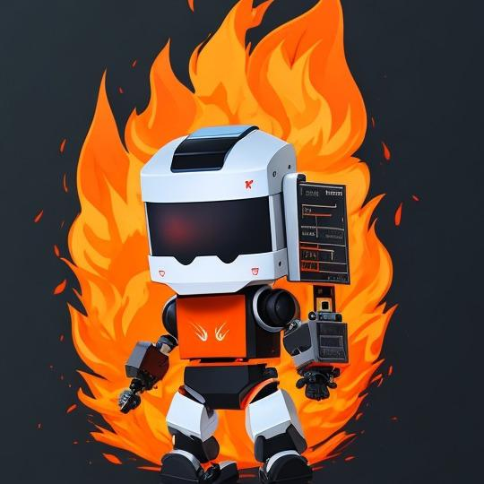

# FireWall - Equipe da Olimpíada Brasileira de Robótica Prática

## Descrição da Equipe

Repositório da equipe FireWall da Olimpíada Brasileira de Robótica Prática! Somos uma equipe apaixonada por robótica e engenharia, dedicada a criar soluções inovadoras para desafios emocionantes da competição.

## Sobre a Olimpíada Brasileira de Robótica Prática

A Olimpíada Brasileira de Robótica Prática é uma competição nacional que tem como objetivo incentivar o interesse e a criatividade de estudantes na área da robótica. Os times competem em uma série de tarefas práticas que testam suas habilidades de programação, engenharia e trabalho em equipe.

## Nossos Objetivos

O principal objetivo da equipe FireWall é se destacar na competição, alcançando o mais alto nível de desempenho possível. Para isso, estamos focados em:

1. Desenvolver soluções inovadoras: Buscamos criar robôs e programas de alta eficiência que superem os desafios propostos de maneira criativa e original.

2. Trabalho em equipe: Acreditamos que a colaboração e a comunicação eficiente são essenciais para o sucesso. Valorizamos a contribuição de cada membro da equipe.

3. Aprendizado contínuo: Estamos sempre aprimorando nossas habilidades técnicas, aprendendo com cada experiência e buscando feedback para melhorar constantemente.

## Pastas do Repositório

- `UtilCode`: Contém todo o código-fonte desenvolvido para nossos robôs e programas.

- `teste`: Aqui você encontrará os esboços e testes para melhor entendimento do funcionamento do robo

- `images`: Guardamos fotos e vídeos de nossos robôs em ação durante os treinos e competições.

- `DeadCode`: aqui guardamos codigo morto que so deus sabe se sera utilizado novamente...

## Iniciar

Para iniciar basta fazer o upload dos arquivos para o Ev3 e executar o arquivo main.py que se encontra na pasta principal!

